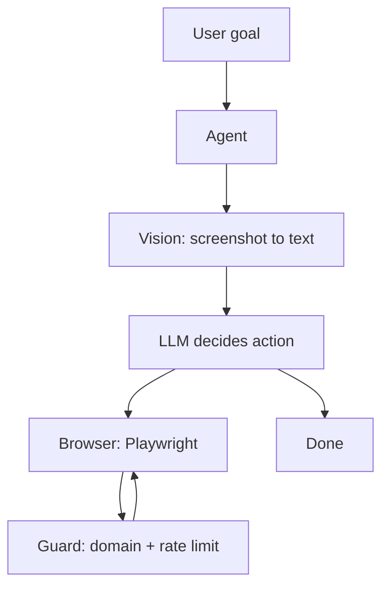

# Architecture

Four layers:

| Layer | Responsibility |
|---|---|
| **Vision** | Converts page screenshots to structured observations |
| **Agent** | Chooses next action: goto, click, type, done |
| **Browser** | Executes actions via Playwright |
| **Guard** | Blocks foreign domains, enforces rate limits |
